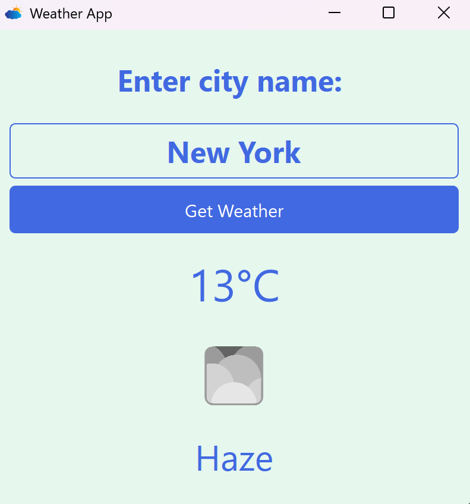

# Weather API App

A simple Weather API App retrieve and display real-time weather information by city name.

## Preview



---

## How to Use

1. **Clone the Repository**
```bash
    git clone https://github.com/yuutoa/weather-api-app.git
    cd weather-api-app
```

2. **Create and Activate a Virtual Environment**
```bash
    python -m venv env
    # For Windows
    .\env\Scripts\activate
    # For Linux/Mac
    source env/bin/activate
```

3. **Install Dependencies**
```bash
    pip install -r requirements.txt
```

4. **Create an Account and Get API Key**  
   - Visit [OpenWeatherMap API](https://openweathermap.org/api) and create a free account.
   - Generate an API key.

5. **Add API Key to `weather_app.py`**
   - Open `weather_app.py` and go to line 120.
   - Replace the line with your API key:
```python
    api_key = 'your_key'
```

6. **Run the Program**
```bash
    python weather_app.py
```

7. **Search for Cities**
   - Enter city name to get weather information displayed instantly.

---

[Yuuto Akihiro](https://github.com/yuutoa)
